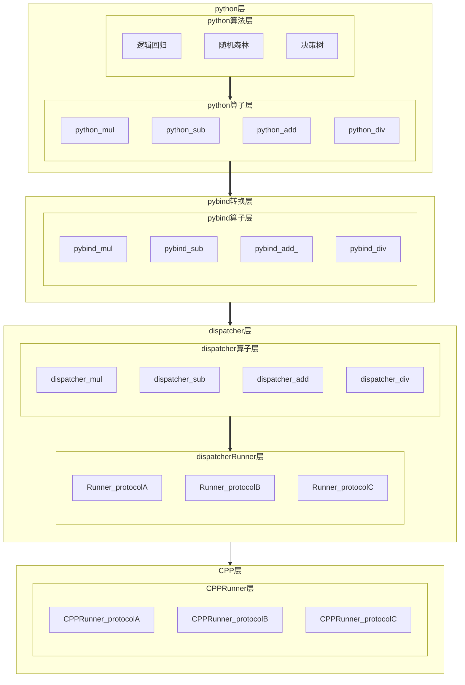

# Dispatcher

> **背景** 现有多套计算系统，每套系统有自己的计算算子，比如加法、乘法、卷积等操作（底层协议不同）。



### 代理
```shell
export https_proxy="http://127.0.0.1:1080"
export http_proxy="http://127.0.0.1:1080"
```


### bazel install

```shell
wget  https://github.com/bazelbuild/bazel/releases/download/6.1.1/bazel-6.1.1-installer-linux-x86_64.sh
sudo bash bazel-6.1.1-installer-linux-x86_64.sh
which bazel
```