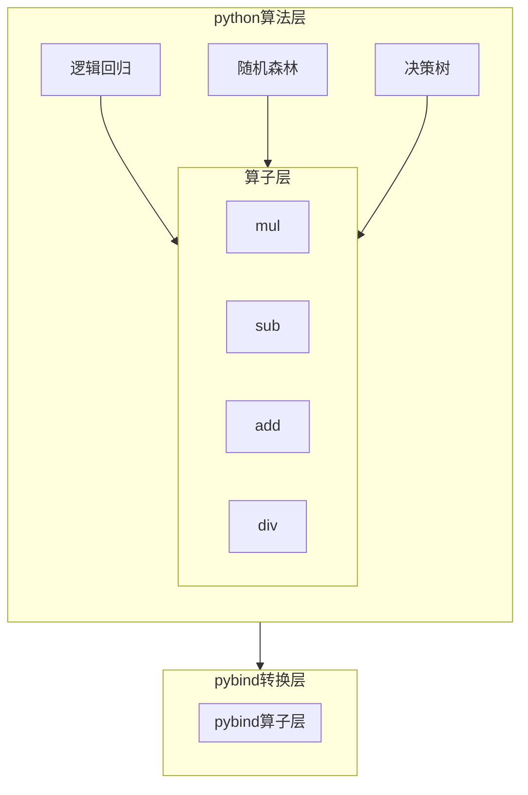

# Dispatcher

> **背景** 现有多套计算系统，每套系统有自己的计算算子，比如加法、乘法、卷积等操作（底层协议不同）。


```mermaid
flowchart TB
    direction TB
    subgraph python算法层
        direction TB
        逻辑回归-->算子层
        随机森林-->算子层
        决策树-->算子层
        subgraph 算子层
            direction LR
            mul
            sub
            add
            div
        end
    end
    python算法层-->pybind转换层
    subgraph pybind转换层
        subgraph pybind算子层
            direction LR
            mul
            sub
            add
            div
        end
    end


```

```shell
export https_proxy="http://127.0.0.1:1080"
export http_proxy="http://127.0.0.1:1080"
```
