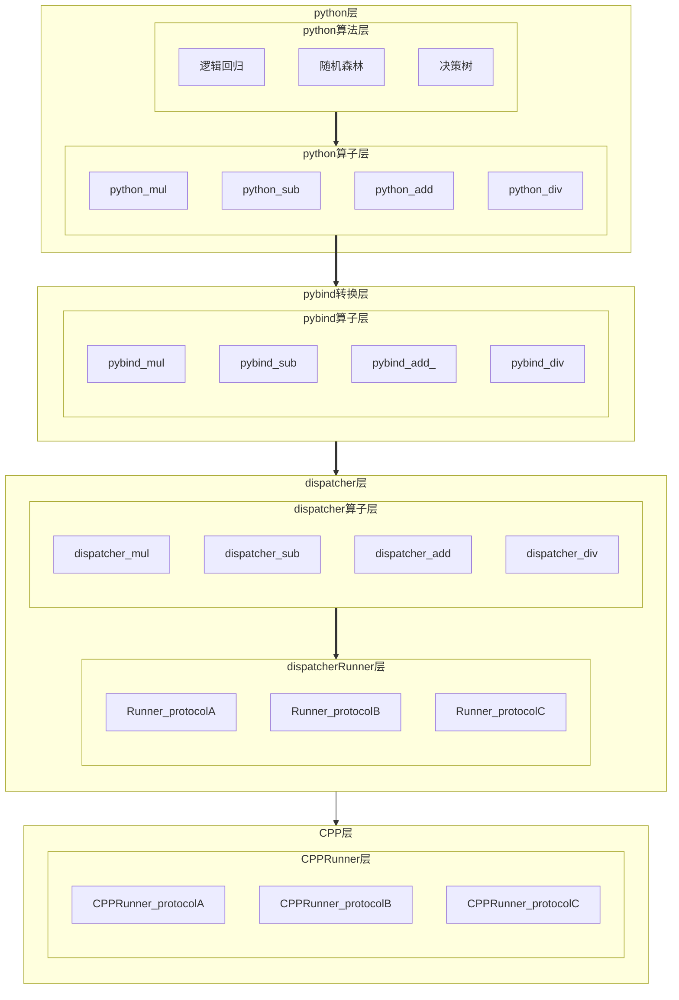

# Dispatcher

> **背景** 现有多套计算系统，每套系统有自己的计算算子，比如加法、乘法、卷积等操作（底层协议不同）。



### 代理

```shell
export https_proxy="http://127.0.0.1:1080"
export http_proxy="http://127.0.0.1:1080"
```

### bazel install

```shell
wget  https://github.com/bazelbuild/bazel/releases/download/6.1.1/bazel-6.1.1-installer-linux-x86_64.sh
sudo bash bazel-6.1.1-installer-linux-x86_64.sh
which bazel
```

### 虚函数 & 模版

**模版类可以有虚函数，但类的模版成员函数不能是虚函数**

首先，如果你想将模板函数声明为虚函数，你需要将它声明为类模板的一部分，而不是一个独立的函数模板。这是因为虚函数必须属于类的成员函数。

```cpp
template<typename T>
class Protocol {
  virtual bool add(const NumberArr<T>* left); // 模版类的成员函数可以为虚函数
};
```

```cpp
class Protocol {
  template <typename T>
  bool add(const NumberArr<T>* left);  // 类的模版函数不能声明为虚函数
};
```
